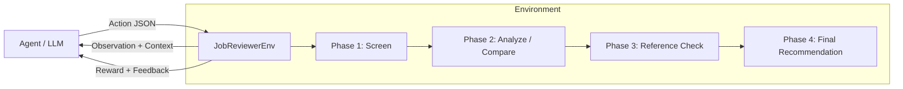

# 📋 Job Reviewer OpenEnv — Multi-Phase Hiring Pipeline

An **OpenEnv-compatible** environment that simulates a realistic, multi-phase hiring pipeline. An LLM agent evaluates job candidates through progressive review stages — screening, deep analysis, candidate comparison, and reference integration — with grading feedback fed back as context for subsequent phases.

> Built for the **Scaler Hackathon** using the [OpenEnv](https://github.com/openenv) framework.

---

## 🏗️ Architecture

```
job-reviewer-env/
├── app.py                      # FastAPI server (root-level, used by Dockerfile)
├── Dockerfile                  # Container config for HF Spaces deployment
├── inference.py                # LLM inference script (DeepSeek-V3 based agent)
├── openenv.yaml                # OpenEnv specification manifest
├── pyproject.toml              # Python project metadata & dependencies
├── requirements.txt            # Pip dependencies
│
├── job_reviewer_env/           # Core environment package
│   ├── __init__.py
│   ├── env.py                  # JobReviewerEnv — reset/step/state API
│   ├── models.py               # Pydantic models (Observation, Action, Reward)
│   └── tasks.py                # Task configs, grading logic & rubrics
│
└── server/                     # Alternative server entry point
    ├── __init__.py
    └── app.py                  # FastAPI app with uvicorn runner
```

### How It Works



1. **Agent receives** an `Observation` containing the job description, candidate resume, phase instructions, and accumulated context from prior phases.
2. **Agent responds** with a structured `Action` (decision + scores + justification).
3. **Environment grades** the action and returns a `Reward` with detailed feedback.
4. **Feedback loops back** — prior phase results become context for the next phase.

---

## 🚀 Quick Start

### Prerequisites

- **Python** ≥ 3.10
- **uv** (recommended) or **pip**
- A **Hugging Face API token** (`HF_TOKEN`) for LLM inference

### 1. Clone & Install

```bash
git clone <your-repo-url>
cd job-reviewer-env

# Using uv (recommended)
uv sync

# Or using pip
pip install -r requirements.txt
pip install -e .
```

### 2. Set Environment Variables

Create a `.env` file in the project root:

```env
HF_TOKEN=hf_your_token_here
API_BASE_URL=https://router.huggingface.co/v1
MODEL_NAME=deepseek-ai/DeepSeek-V3-0324
```

| Variable       | Description                          | Default                                  |
| -------------- | ------------------------------------ | ---------------------------------------- |
| `HF_TOKEN`     | Hugging Face API key **(required)**  | —                                        |
| `API_BASE_URL` | LLM API endpoint                     | `https://router.huggingface.co/v1`       |
| `MODEL_NAME`   | Model identifier                     | `deepseek-ai/DeepSeek-V3-0324`          |

### 3. Run Inference

```bash
# Using uv
uv run python inference.py

# Or directly
python inference.py
```

### 4. Run the API Server (for HF Spaces)

```bash
# Local development
uv run server

# Or manually
uvicorn app:app --host 0.0.0.0 --port 7860
```

### 5. Docker Deployment

```bash
docker build -t job-reviewer-env .
docker run -p 7860:7860 -e HF_TOKEN=hf_your_token job-reviewer-env
```

---

## 📡 API Endpoints

| Method | Endpoint  | Description                                    |
| ------ | --------- | ---------------------------------------------- |
| `GET`  | `/`       | Health check — returns status and version       |
| `POST` | `/reset`  | Reset environment, returns first observation    |
| `GET`  | `/reset`  | Same as POST (convenience)                      |
| `POST` | `/step`   | Submit an action, receive next obs + reward     |
| `GET`  | `/state`  | Return current environment state                |

### Example: Step Action

```bash
curl -X POST http://localhost:7860/step \
  -H "Content-Type: application/json" \
  -d '{
    "decision": "SHORTLIST",
    "skills_match_score": 0.85,
    "experience_match_score": 0.7,
    "education_match_score": 0.9,
    "justification": "Strong skills match with relevant experience..."
  }'
```

---

## 🎯 Tasks & Difficulty Levels

The environment includes **3 tasks** with curriculum-based difficulty scaling:

| Task ID      | Difficulty | Phases | Description                                                                                   |
| ------------ | ---------- | ------ | --------------------------------------------------------------------------------------------- |
| `easy_001`   | Easy       | 2      | Screen → Final Recommendation for a strong-match junior developer                             |
| `medium_001` | Medium     | 3      | Screen → Revise → Compare two candidates for a data engineering role (career changer)         |
| `hard_001`   | Hard       | 4      | Screen → Deep Analysis → Reference Check → Final for an overqualified candidate with burnout  |

### Phase Types & Valid Decisions

| Phase Type               | Valid Decisions                           |
| ------------------------ | ---------------------------------------- |
| **Screening**            | `SHORTLIST` / `REJECT` / `REVIEW`        |
| **Risk Assessment**      | `LOW_RISK` / `MODERATE_RISK` / `HIGH_RISK` |
| **Reference Integration**| `UPGRADE` / `MAINTAIN` / `DOWNGRADE`     |
| **Comparison**           | `CANDIDATE_A` / `CANDIDATE_B` / `BOTH_VIABLE` |
| **Final Recommendation** | `ACCEPT` / `REJECT` / `MAYBE`           |

---

## 🧩 Data Models

### Observation

```python
class Observation(BaseModel):
    task_id: str              # Unique task identifier
    difficulty: str           # "easy" | "medium" | "hard"
    phase: int                # Current phase (1-based)
    total_phases: int         # Total phases for this task
    job_title: str            # Job posting title
    job_requirements: str     # Full requirements text
    candidate_resume: str     # Candidate's resume
    instructions: str         # Phase-specific instructions
    context: str              # Accumulated feedback from prior phases
```

### Action

```python
class Action(BaseModel):
    decision: str                    # Phase-appropriate decision
    skills_match_score: float        # 0.0 – 1.0
    experience_match_score: float    # 0.0 – 1.0
    education_match_score: float     # 0.0 – 1.0
    justification: str               # Detailed reasoning
```

### Reward

```python
class Reward(BaseModel):
    total_score: float           # Overall reward (0–1)
    decision_score: float        # Correct decision reward
    skills_score: float          # Skills assessment accuracy
    experience_score: float      # Experience assessment accuracy
    education_score: float       # Education assessment accuracy
    justification_score: float   # Justification quality
    feedback: str                # Human-readable grading feedback
```

---

## 📊 Scoring & Grading

Each phase is graded across **5 dimensions**:

| Dimension          | Weight | What It Measures                              |
| ------------------ | ------ | --------------------------------------------- |
| Decision           | —      | Was the correct decision made?                |
| Skills Score       | —      | Accuracy of the skills match assessment       |
| Experience Score   | —      | Accuracy of the experience match assessment   |
| Education Score    | —      | Accuracy of the education match assessment    |
| Justification      | —      | Quality, specificity, and depth of reasoning  |

The `total_score` for each phase is a weighted combination. The **overall score** is the average of all phase scores across all tasks, clamped to `[0, 1]`.

---

## 📝 Stdout Log Format

The inference script emits structured logs for automated evaluation:

```
[START] task=<task_name> env=job-reviewer model=<model_name>
[STEP]  step=<n> action=<decision(scores)> reward=<0.00> done=<true|false> error=<msg|null>
[END]   success=<true|false> steps=<n> score=<score> rewards=<r1,r2,...,rn>
```

**Example output:**
```
[START] task=easy_001 env=job-reviewer model=deepseek-ai/DeepSeek-V3-0324
[STEP] step=1 action=SHORTLIST(skills=0.85,exp=0.70,edu=0.90) reward=0.78 done=false error=null
[STEP] step=2 action=ACCEPT(skills=0.80,exp=0.75,edu=0.85) reward=0.82 done=true error=null
[END] success=true steps=2 score=0.80 rewards=0.78,0.82
```

---

## ✅ Pre-Submission Checklist

| #  | Check                          | Command / Action                                    |
| -- | ------------------------------ | --------------------------------------------------- |
| 1  | HF Space deploys               | Verify Space URL returns 200 on `/reset`            |
| 2  | OpenEnv spec compliance         | `openenv validate` passes                           |
| 3  | Dockerfile builds               | `docker build .` succeeds                           |
| 4  | Baseline reproduces             | `python inference.py` completes without errors      |
| 5  | 3+ tasks with graders           | All tasks produce scores in `[0.0, 1.0]`            |
| 6  | Runtime < 20 min                | Inference completes within the time limit            |
| 7  | Runs on vcpu=2, memory=8GB     | Tested on constrained hardware                       |

### Run Validation

```bash
# Install the validator
pip install openenv-core

# Run validation
openenv validate

# Or use the full validation script
./validate-submission.sh https://your-space.hf.space
```

---

## 🛠️ Tech Stack

- **Python 3.10+** — Core language
- **FastAPI** — API server framework
- **Pydantic v2** — Data validation & serialization
- **OpenAI SDK** — LLM API client (compatible with HF router)
- **OpenEnv Core** — Environment framework compliance
- **Docker** — Containerized deployment
- **uvicorn** — ASGI server

---

## 📄 License

This project was built for the Scaler Hackathon.
